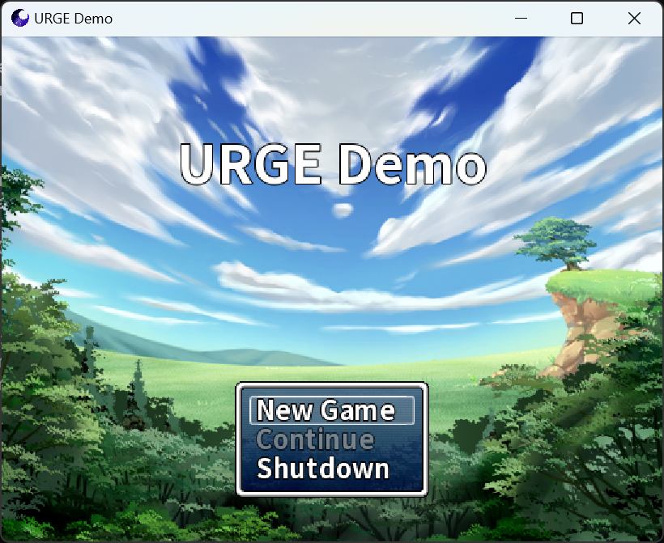

#  Universal Ruby Game Engine

## Language selection 语言选择
- [English](README_EN.md)
- [简体中文](README.md)

## Overview

- URGE is a game engine compatible with RGSS 1/2/3 series APIs, utilizing SDL3 as the cross-platform underlying library and WebGPU/Dawn as the rendering RHI, providing support for modern APIs like D3D12/Vulkan (legacy OpenGL family and pre-D3D11 APIs are no longer supported).  
- This project is open-source under the BSD-2-Clause License.  
- Project style follows The Chromium Project.  
- Inspired by Chromium.  

## Snapshots

## Features

- **Multithreading**: Game logic and rendering logic run on separate independent threads, maximizing the advantages of multi-core processors.  
- **Modern Graphics APIs**: Leveraging the WebGPU specification, the engine supports modern graphics APIs like D3D11/D3D12/Vulkan, delivering superior performance compared to the OpenGL family.  
- **Cross-Platform**: Supports Windows, Linux, Android, and WASM/Emscripten platforms. (Official support for macOS and iOS will not be provided until we find a reason to purchase Apple products.)  
- **High Performance**: The game script layer uses a decoupled design, allowing integration with interpreters like MRI, MRuby, and TruffleRuby to maximize scripting language processing speed.  

## Third-Party Libraries

### Included in the Project Source Code
- SDL_image - https://github.com/libsdl-org/SDL_image  
- SDL_ttf - https://github.com/libsdl-org/SDL_ttf  
- dav1d - https://github.com/videolan/dav1d  
- imgui - https://github.com/ocornut/imgui  
- concurrentqueue - https://github.com/cameron314/concurrentqueue  
- fiber - https://github.com/paladin-t/fiber  
- inih - https://github.com/benhoyt/inih  
- rapidxml - https://rapidxml.sourceforge.net/  
- magic_enum - https://github.com/Neargye/magic_enum  

### External Dependencies
- dawn - https://dawn.googlesource.com/dawn  
- SDL3 - https://github.com/libsdl-org/SDL  
- freetype - https://github.com/freetype/freetype  
- zlib - https://github.com/madler/zlib  
- physfs - https://github.com/icculus/physfs  

## Contact

- Email: admenri0504@gmail.com / admenri@qq.com  
- Website: https://admenri.com/  

© 2015-2025 Admenri
