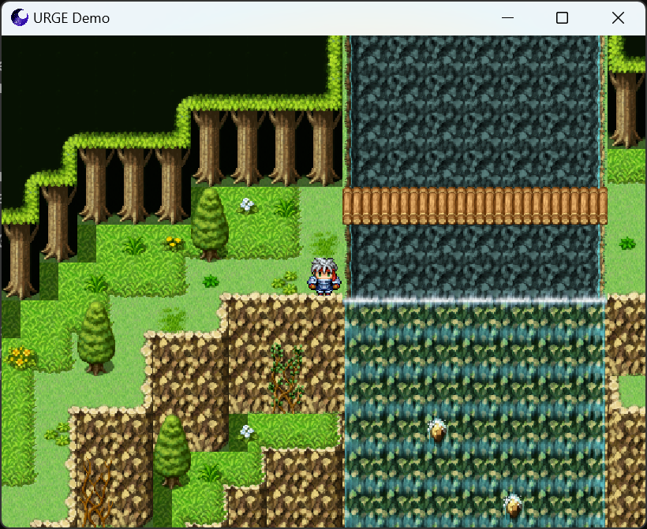
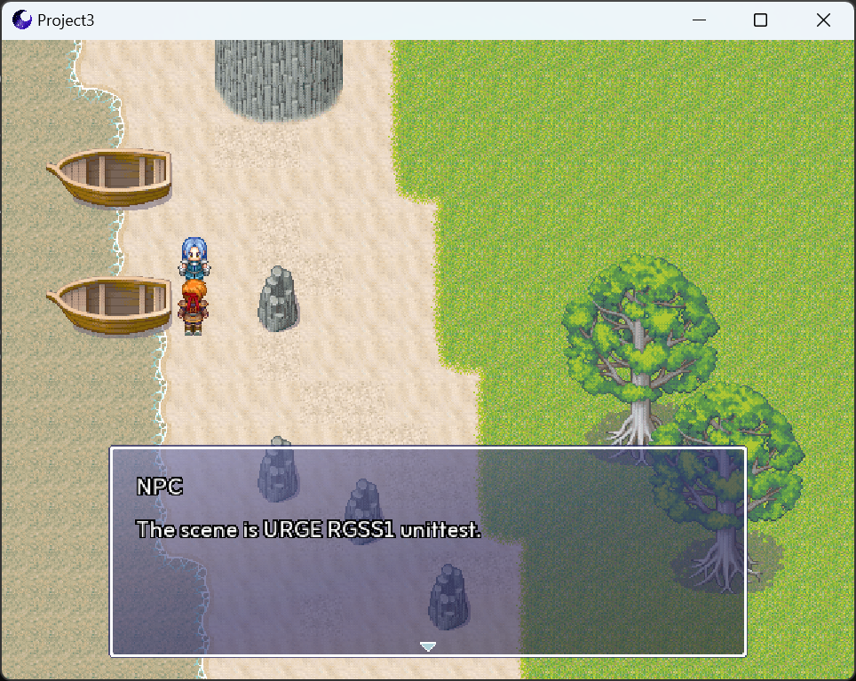
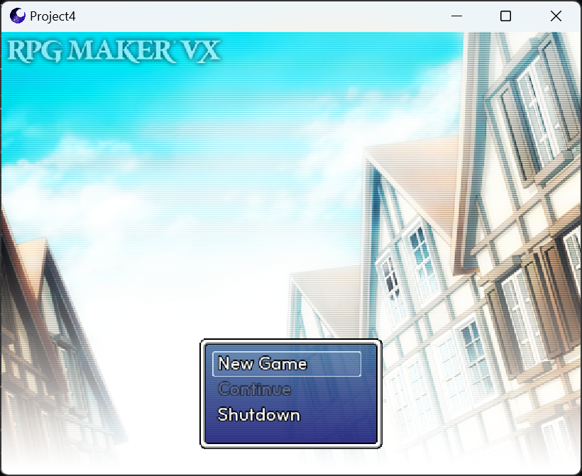
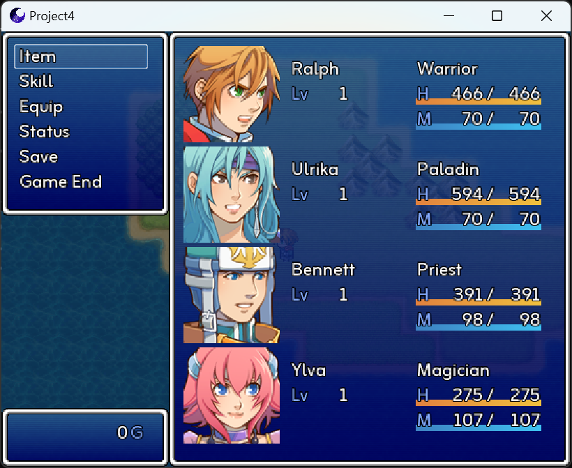

#  Universal Ruby Game Engine URGE

## Language selection
- [English](README_EN.md)
- [简体中文](README.md)

## Overview

- URGE is a game engine compatible with the RGSS 1/2/3 API.
- It uses SDL3 as the underlying library and supports platforms such as Windows, Linux, Android, and WASM/Emscripten.
- It leverages DiligentCore as the rendering RHI, providing support for modern APIs like D3D12 and Vulkan.
- This project is open-source under the BSD-2-Clause license.
- The project style is inspired by The Chromium Project.
- It is inspired by Chromium and RGModern.

## Screenshots







## Features

- **Multithreading**: The game logic and rendering logic of the engine are separated into two independent threads, maximizing the utilization of multi-core processors.
- **Modern Graphics APIs**: Thanks to the rendering capabilities of DiligentCore, the engine supports modern graphics APIs like D3D12 and Vulkan, offering better performance compared to the OpenGL family.
- **Cross-platform**: The engine supports platforms such as Windows, Linux, Android, and WASM/Emscripten.
- **High Performance**: The game script layer uses a decoupled approach, allowing integration with CRuby, MRuby, Crystal, and other language backends to maximize script language processing speed.

## Build Instructions

1. Ensure that your CMake version is ≥ 3.20.
2. Execute the clone command:
   ```
   git clone --recursive https://github.com/Admenri/urge.git
   ```
3. Execute the build script:
   ```
   cmake -S . -B out
   ```
4. Execute the compilation:
   ```
   cmake --build out --target console_engine
   ```

## Third-Party Libraries

### Included in the Project Source Code
- SDL_image - https://github.com/libsdl-org/SDL_image  
- SDL_ttf - https://github.com/libsdl-org/SDL_ttf  
- dav1d - https://github.com/videolan/dav1d  
- imgui - https://github.com/ocornut/imgui  
- concurrentqueue - https://github.com/cameron314/concurrentqueue  
- fiber - https://github.com/paladin-t/fiber  
- inih - https://github.com/benhoyt/inih  
- rapidxml - https://rapidxml.sourceforge.net/  
- magic_enum - https://github.com/Neargye/magic_enum  
- soloud - https://github.com/jarikomppa/soloud  

### External References
- SDL3 - https://github.com/libsdl-org/SDL  
- DiligentCore - https://github.com/DiligentGraphics/DiligentCore  
- freetype - https://github.com/freetype/freetype  
- physfs - https://github.com/icculus/physfs  
- zlib - https://github.com/madler/zlib  
- ogg - https://github.com/xiph/ogg  
- vorbis - https://github.com/xiph/vorbis  
- ruby - https://github.com/ruby/ruby  

## Contact Information

- Email: admin@admenri.com  
- Website: https://admenri.com/  

© 2015-2025 Admenri
